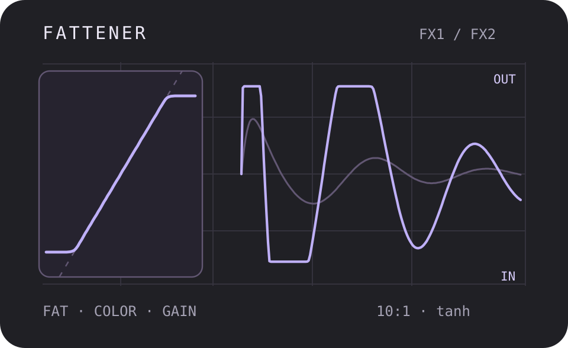
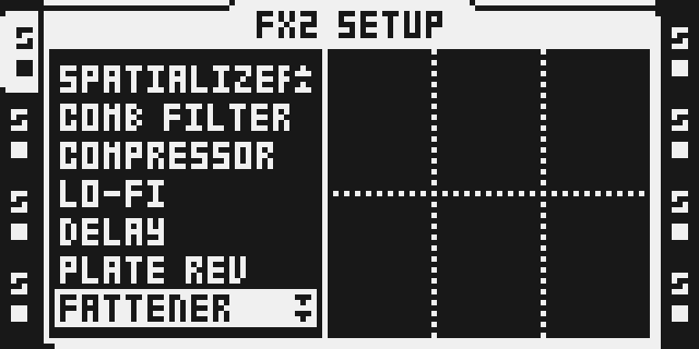
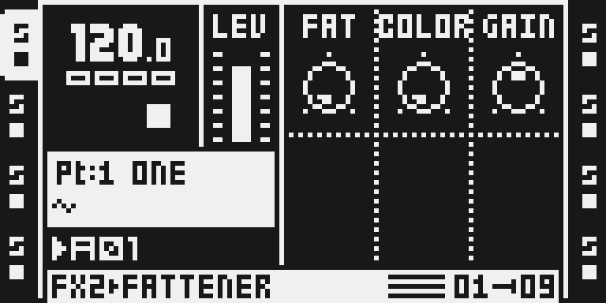
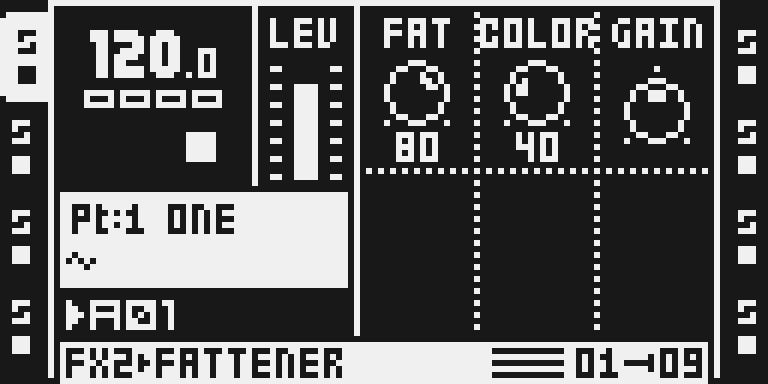

# Fattener

Version: 0.1.0-experimental · author: @devilfish707 · algorithm: JClones (MIT)

**Source draft.** It is outside native discovery, the catalog and the
firmware builder until hardware qualification and owner review are done
(see [Tests and measurements](#tests-and-measurements)).

## Overview

Fattener is a DSP56300 port of JClones' Fattener, an MIT-licensed JSFX that
clones a well-known loudness plugin. It makes a track louder and thicker:

1. GAIN sets the level going in, −24 to +24 dB.
2. A highpass clears the subsonics.
3. A peak EQ shapes what drives the compressor. COLOR moves it from 40 Hz
   up to 6.7 kHz and raises it from 0 to +8 dB.
4. A 10:1 compressor follows one envelope for both channels (stereo
   linked: a loud left side turns the right side down too). FAT lowers its
   threshold from −1 to −35 dB and raises its makeup from +1 to +40 dB
   together, so the level goes up as the dynamics come down.
5. A tanh soft clip catches the peaks above a knee at 0.9 of full scale.
   COLOR raises the knee until, at 127, it is a hard clip at full scale.
6. The output is lowered by 0.1 dB, as in the JSFX.

The Octatrack applies AMP VOL before the FX chain, so at the default VOL 64 a
normalized sample reaches the effect about 12 dB below where it reaches the
JSFX in a DAW. Fattener's threshold and clip are defined relative to the
JSFX's 0 dBFS, so the module runs the JSFX at +12 dB in and −12 dB out
(`JSFX(4x) / 4`): a normalized sample at VOL 64 is compressed and clipped as
it is by the JSFX, and the output keeps the JSFX's level relative to the
input. TapeHead, IronOxide5 and Inflator were fixed the same way after they
were heard on the unit; Fattener has it from the start.

It is a buffer-free insert: no allocator memory, no bus role and no
absolute Y addresses, so it runs on FX1 or FX2 of any track.

The first test image (OCTABAM10) followed the JSFX exactly and cost more
than stock SPRING REV; on the unit it caused CPU overruns under p-locks and
scene-fader moves. This version takes about half the DSP time with three
simplifications, each measured against the JSFX:

- **One highpass** (36.5 Hz, Q 0.78) for the JSFX's 20 Hz and 30 Hz pair,
  within 0.5 dB of the pair from 20 Hz up.
- **The EQ interpolated** between 17 precomputed designs (COLOR 0, 1/16 …
  1), within 0.17 dB of the exact EQ. A COLOR p-lock or scene move now
  costs about 130 instructions in its block instead of about 390.
- **The compressor's gain once per 16-sample block** (0.36 ms), ramped
  linearly across the block; the envelope it follows still runs every
  sample, so the attack and release are the JSFX's.

At the unit's level the output is within 0.24 dB of the JSFX's on a sine,
a kick and noise, and its distortion within 0.1 dB.

The author's octabam tree had two earlier attempts. The first was dropped
for a whine and its cost; the second was written without the JSFX text and
never assembled. This is a new port from the JSFX source. The whine is
gone: the filters feed their rounding error back, so after the signal stops
the output reaches exact silence (about 0.14 s after a burst at full gain)
instead of holding a small cycle that the compressor's makeup would
amplify.

## Controls

All three controls are on the FX main page. The SETUP page has no Fattener
controls.

| slot | control | default | range | what it does |
|---|---|---|---|---|
| 0 | FAT | 0 | 0–127 | Fattness, 0–100%: the compressor's threshold from −1 to −35 dB and its makeup from +1 to +40 dB. |
| 1 | COLOR | 0 | 0–127 | Color, 0–100%: the EQ from 40 Hz at 0 dB to 6.7 kHz at +8 dB (f = 40 + 6680·c^3.22 Hz), and the clip knee from 0.9 to a hard clip at 1.0. |
| 2 | GAIN | 64 | drawn −64…+63 | Input gain, −24 to +23.6 dB in 3/8 dB steps; 0 is 0 dB. |

The defaults are the JSFX's. At FAT 0 the compressor's threshold is −1 dB
with +1 dB of makeup, so the defaults already compress the loudest peaks
lightly.

## Usage

1. Select an audio track that plays a sample.
2. Hold FUNC and press FX2 (or FX1) to open its SETUP. Turn LEVEL to
   FATTENER and press YES.
3. Press FX2 (or FX1) for the main page.

A useful start on drums: FAT 60–90, COLOR 20–40, GAIN 0. More FAT is
louder and denser; GAIN decides how hard the track drives the compressor
and clip, and COLOR shifts the emphasis upwards and hardens the clip.

## Quick tutorial: fatten a drum loop

1. **Set up.** On a track playing a drum loop, hold FUNC and press FX2, turn LEVEL to FATTENER and press YES. Press FX2 to see FAT, COLOR and GAIN at the JSFX defaults.
2. **Fatten.** Turn FAT up to about 80: the loop gets louder and denser as the compressor pulls the peaks in and the makeup lifts the rest.
3. **Color.** Turn COLOR up to move the emphasis from the kick towards the snare and hats, and to harden the clip. Use GAIN to drive it harder or back off.

## Compatibility and limitations

- Location: FX1 or FX2, any of the eight tracks. Effect ID 0x0e, which is
  not a stock ID and no Octamod module or draft claims. Build priority 20
  and harness letter `9`. The ledger found no clash; `make modules` stays
  the arbiter.
- OS 1.40C only. MKI and MKII use the same DSP code; the MKII panel has been
  captured in the emulator only.
- The filter and EQ frequencies assume 44.1 kHz.
- The simplifications above: the low cut is one 12 dB/octave highpass
  where the JSFX has two in series (−15.4 against −18.6 dB at 15 Hz), the
  EQ is within 0.17 dB of the JSFX's, and the gain moves in 0.36 ms ramps.
- AMP VOL is part of the drive, as the track level into the JSFX would be
  in a DAW.
- The module can add up to 63 dB of gain (GAIN +23.6 dB and FAT's makeup
  +40 dB), and then the filters' last bit is amplified with everything
  else: on impulse tails at full gain the output differs from the float
  model by up to 5e-3 (−46 dBFS) until it reaches exact silence, within
  about 0.14 s.
- The output is held at the JSFX's full scale by the clip; at COLOR 127 it
  is the JSFX's hard clip.
- Cost: 193 cycles/sample (static counter), every setting the same. Eight
  instances on one core (FX1 and FX2 on four tracks) price at 1,544 of the
  3,120 cycles/core modules may use.

## Tests and measurements

See [TESTING.md](TESTING.md) for commands and numbers. In short:

- **Against its model (emulator):** `verify.py` assembles `fattener.asm`,
  runs it in `dsp_host` and compares it with `reference.render_model()`:
  `JClones_Fattener.jsfx` line for line with the three simplifications.
  Peak error 2.1e-3 over ten knob settings (defaults, extremes, every
  corner) × nine signals at two levels (−2 dBFS, and 0.22 FS: a normalized
  sample at VOL 64), within 5 LSB of the filter chain times the gain where
  that is above 63 dB. The worst case is the EQ's 24-bit words near its
  40 Hz poles (COLOR ≈ 10, 0.13 dB).
- **Against the JSFX itself:** the output level of a sine, a kick and noise
  within 0.24 dB at five settings, and the THD of a normalized 100 Hz sine
  at the unit's level within 0.1 dB.
- **Other gates:** silence in gives silence out, also from an instance
  block filled with garbage; after a burst at full gain the output is
  exactly zero again within 137 ms, at every COLOR. The stereo link follows
  the shared envelope, and a silent channel stays silent beside a loud one.
  A trigger inside a block (a split call) keeps every state and starts a
  new gain ramp, as the model does. The sample routine is straight-line;
  no `mpysu`. In the composed test image it renders within 6.3e-4 of the
  model.
- **Against SPRING REV (emulator, `benchmark.py`):**

  | | Fattener | first build | Spring Reverb |
  |---|---:|---:|---:|
  | one instance, instructions per sample | 195 | 327 | 262 |
  | four per core, worst peak per 16-sample block | 13,536 | 22,748 | 20,376 |
  | init, per instance | 549 | 3,329 | 95 |
  | DSP program | 698 words (473 code, 225 table) | 951 words | 1,063 words |
  | FX2 instance buffer | none | none | 16,384 words |
  | state and tables | 160 words of its r7 block | 218 | — |

- **How it got there:** 334 → 193 cycles/sample. The gain at block rate
  saved about 50 instructions a sample and the single highpass about 40;
  the rest came from the soft clip, which now reads its constants through
  one pointer with parallel moves and takes its sign from the filter's
  output. The tanh table
  and every constant now come from a P table copied in init (the build
  places it), instead of being built with 89 divisions.
- **Composed build:** `fattener-spring` builds, packs into
  `OCTATRACK_OCTABAM11.bin` with a valid checksum, boots in the emulator
  and draws the chooser and page below. `verify_menu`, `verify_initregs`,
  `verify_replaces --image` and `cycle_count.py --verify` pass.
- **On hardware:** OCTABAM10 (the first build) gave CPU overruns on the
  author's unit in some situations, under p-locks and scene-fader moves.
  OCTABAM11 (this source) ran about ten minutes on four tracks under heavy
  load (p-locks and scene moves) on the author's MKII and "works great". A
  listening test, not a stress run.
- **Not done:** the 60-minute eight-track hardware stress project
  and worst-case cycles measured on hardware.

## Authorship and licences

- Fattener port, manifest, generator, gate, reference model and
  documentation: @devilfish707, MIT ([LICENSE](LICENSE)).
- Algorithm: JClones_Fattener.jsfx, Copyright (c) 2026 JClones, MIT
  (JSFXClones revision `88a1503d`). The full notice is in
  [LICENSE](LICENSE) and
  [`../../octabam/licenses/jsfxclones.txt`](../../octabam/licenses/jsfxclones.txt).
- Built and verified with the octabam SDK, Copyright (c) 2026 Sam Banks, MIT.
- The thumbnail is original, drawn from `reference.py`'s output. It is an
  illustration, not an Octatrack screenshot.
- No Elektron firmware, extracted routines or tables are included.

## Screens and audio

Captured from the MKII panel of the Octamod emulator running the hardware
test image (`hardware-test-remix.py`): real LCD pixels, not a
reconstruction. No audio is included.

## Files

| file | what it is |
|---|---|
| `fattener.asm` | the DSP56300 source, written by `gen_asm.py` |
| `gen_asm.py` | writes `fattener.asm` and the manifest's P table: the polynomial fits, the highpass, the 17 EQ designs, the tanh table and the knob maps |
| `manifest.py` | the native declaration: ID, menu, controls, P table, gate |
| `verify.py` | the render gate (standalone `dsp_host`, no firmware) |
| `reference.py` | the JSFX's processing in Python, the module's float model and the knob mapping |
| `benchmark.py` | instruction counts against stock SPRING REV (needs your local 1.40C) |
| `hardware-test-remix.py` | the remix the OCTABAM10 and OCTABAM11 test images were built from |
| `octamod.module.json` | website metadata |
| `qualification.example.json` | the qualification record, incomplete |
| `presentation/thumbnail.svg` | the card illustration |
| `media/` | emulator LCD captures and their provenance |
