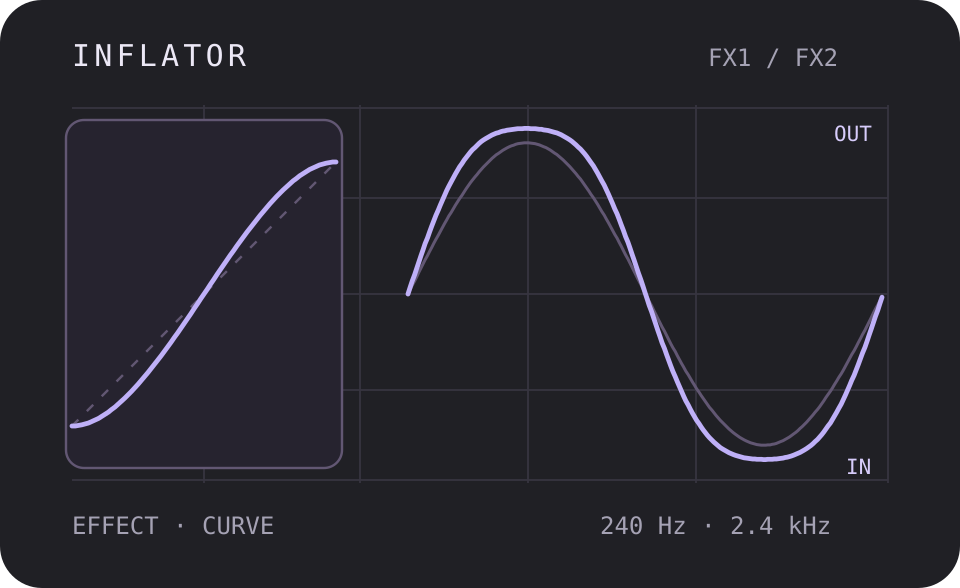
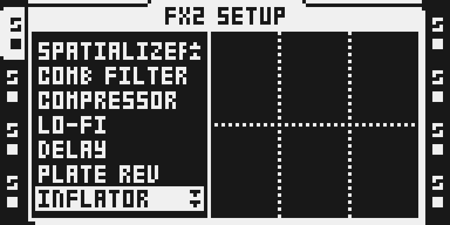
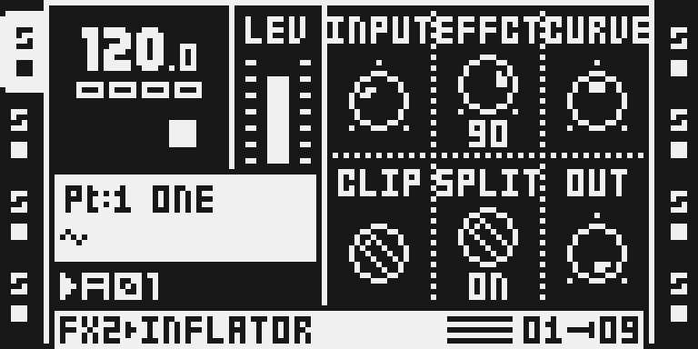

# Inflator

Version: 0.1.0-experimental · author: @devilfish707 · algorithm: JClones (MIT)

**Source draft.** It is outside native discovery, the catalog and the
firmware builder until hardware qualification and owner review are done
(see [Tests and measurements](#tests-and-measurements)).

## Overview

Inflator is a DSP56300 port of JClones' OInflator, an MIT-licensed clone of
the Oxford Inflator. It raises perceived loudness and density without
obvious distortion:

1. INPUT sets the level, and CLIP limits it at the JSFX's 0 dBFS (ON) or
   +6 dBFS (OFF); see the level note below for where that sits on the unit.
2. A waveshaper g(1 − |g|) lifts mid levels and rounds the peaks. CURVE
   sets how hard it bends; EFFECT blends it with the dry signal.
3. With SPLIT on, the signal is split at 240 Hz and 2.4 kHz and each band
   is shaped on its own, so the bass does not drive the top end.
4. OUTPUT sets the level after it.

The Octatrack applies AMP VOL before the FX chain, so at the default VOL 64 a
normalized sample reaches the effect about 12 dB below where it reaches the
JSFX in a DAW. Inflator's curve is defined relative to the JSFX's 0 dBFS, so
the module runs the JSFX at +12 dB in and −12 dB out (`JSFX(4x) / 4`): a
normalized sample at VOL 64 is inflated as it is by the JSFX, and the output
keeps the JSFX's level relative to the input. The JSFX's 0 dBFS (CLIP ON)
therefore sits at −12 dBFS on the unit's FX bus, which is where a normalized
sample at VOL 64 peaks. Without this (OCTABAM5) EFFECT 127 gave 24 dB less
distortion than the JSFX on the same sample.

There is no oversampling, as in the JSFX. It is a buffer-free insert: no
allocator memory, no bus role and no absolute Y addresses, so it runs on
FX1 or FX2 of any track.

octabam's own inflator ported RCInflator 2 (Oxford Edition). That JSFX
carries no licence, so it cannot be published here; this module is a new
port of the JClones source instead, with the same controls.

## Controls

All six controls are on the FX main page. The SETUP page has no Inflator
controls.

| slot | control | default | range | what it does |
|---|---|---|---|---|
| 0 | INPUT | 42 | 0–127 | Input level, −6 dB at 0 to +12 dB at 126 in 1/7 dB steps (+12.1 dB at 127); 42 is 0 dB. |
| 1 | EFFCT | 0 | 0–127 | Effect amount: 0 is dry, 127 is 100%. |
| 2 | CURVE | 64 | drawn −64…+63 | The JSFX's curve, −50 to +49: below 0 softer, above 0 harder. |
| 3 | CLIP | ON | OFF / ON | Clip the input at the JSFX's 0 dBFS (ON) or +6 dBFS (OFF): with INPUT at 0 dB, a normalized sample at AMP VOL 64 just reaches the ON level. |
| 4 | SPLIT | OFF | OFF / ON | Shape below 240 Hz, 240 Hz–2.4 kHz and above 2.4 kHz separately. |
| 5 | OUT | 127 | 0–127 | Output level, −12 dB at 0 to 0 dB at 127. |

The defaults are the JSFX's. Its EFFECT default is 0 %, which is dry: turn
EFFCT up to hear anything.

## Usage

1. Select an audio track that plays a sample.
2. Hold FUNC and press FX2 (or FX1) to open its SETUP. Turn LEVEL to
   INFLATOR and press YES.
3. Press FX2 (or FX1) for the main page.

A useful start on a drum or mix bus: EFFCT 90, CURVE 64 (0), SPLIT ON, OUT
110. Raise INPUT for more density, and use OUT to keep the level.

## Quick tutorial: inflate a mix bus

1. **Set up.** On a track playing a full loop, hold FUNC and press FX2, turn LEVEL to INFLATOR and press YES. Press FX2 to see INPUT, EFFCT, CURVE, CLIP, SPLIT and OUT at the JSFX defaults: EFFCT 0 is dry.
2. **Inflate.** Turn EFFCT up to about 90 and the loop gets louder and denser. Turn CURVE left for a softer result or right for a harder one; pull OUT down to match the level.
3. **Split and compare.** Switch SPLIT on to shape lows, mids and highs separately. Turn EFFCT back to 0 to hear the dry track.

## Compatibility and limitations

- Location: FX1 or FX2, any of the eight tracks. Effect ID 0x1b, which is
  not a stock ID and no Octamod module or draft claims. Build priority 19
  and harness letter `8`. The ledger found no clash; `make modules` stays
  the arbiter.
- OS 1.40C only. MKI and MKII use the same DSP code; the MKII panel has been
  captured in the emulator only.
- The band-split corners assume 44.1 kHz.
- AMP VOL is part of the drive, as the track level into the JSFX would be in
  a DAW: above VOL 64 a normalized sample hits CLIP ON before INPUT is
  raised. Lower VOL or INPUT for a gentler result.
- With CLIP off, or the band split driven hard, the output can exceed full
  scale and the DSP's output store limits it. Pull OUT down.
- Cost: 89 cycles/sample single band and 258 with SPLIT on (static
  counter). Eight band-split instances on one core (FX1 and FX2 on four
  tracks) price at 2,064 of the 3,120 cycles/core modules may use.

## Tests and measurements

See [TESTING.md](TESTING.md) for commands and numbers. In short:

- **Against the JSFX (emulator):** `verify.py` assembles `inflator.asm`,
  runs it in `dsp_host` and compares it with `reference.py`,
  `JClones_OInflator.jsfx` line for line. Peak error is 5.2e-5 over eleven
  knob settings (both modes, clip on and off, every extreme) × eight
  signals at two levels (−2 dBFS, and 0.22 FS: a normalized sample at VOL
  64). EFFECT 127 on a normalized 100 Hz sine at the unit's level has the
  JSFX's THD within 0.3 dB, single band and split (OCTABAM5: 24 dB less).
  Silence in gives silence out; EFFECT 0 at 0 dB is a passthrough within
  4 LSB (−126 dBFS); CLIP ON holds the output at the JSFX's full scale / 4
  with +12 dB in; the band-split channels are independent and keep their state
  across split calls bit for bit; the sample routines are straight-line; no
  `mpysu`. In the composed test image it renders within 4.8e-7 of the JSFX at the
  defaults.
- **Against SPRING REV (emulator, `benchmark.py`):**

  | | Inflator | Spring Reverb |
  |---|---:|---:|
  | one instance, instructions per sample, single band | 90 | 262 |
  | one instance, instructions per sample, band split | 259 | 262 |
  | four per core, worst peak per 16-sample block | 17,272 | 20,376 |
  | DSP program | 576 words | 1,063 words |
  | FX2 instance buffer | none | 16,384 words |
  | state | 43 words of its r7 block | — |

- **Optimised:** the first version took 1,650 / 5,141 instructions per
  block (single / split). Walking constant tables with post-increment
  pointers and parallel moves, and writing the band-split constants once in
  init, brought it to 1,436 / 4,140, and nearly every instruction in the
  sample loop is now a one-word instruction.
- **Input level** (after TapeHead and IronOxide5 were heard saturating
  less than their plugins on the unit): AMP VOL's (v/127)² ahead of the FX
  left a normalized sample 12 dB short of the JSFX's level. Fixed with
  `JSFX(4x)/4`: the input's `asl` becomes `asl #3` and the output's
  `asl #3` becomes `asl #1`, so no word or cycle is added and the benchmark
  is unchanged. Precision improved (2.1e-4 → 5.2e-5, 15 → 4 LSB), since the
  signal now uses more of the word.
- **Composed build:** `inflator-spring` builds, packs into
  `OCTATRACK_OCTABAM9.bin` with a valid checksum, boots in the emulator and
  draws the chooser and page below, with CLIP and SPLIT printing their
  words. `verify_menu`, `verify_initregs`, `verify_replaces --image` and
  `label_fmt` pass.
- **On hardware (MKII, 2 Oct 2026):** OCTABAM9 ran about two minutes on
  four tracks with p-lock automation and scenes and "sounds great". A
  listening test, not a stress run.
- **Not done:** the 60-minute eight-track hardware stress project
  and worst-case cycles measured on hardware.

## Authorship and licences

- Inflator port, manifest, generators, gate, reference model and
  documentation: @devilfish707, MIT ([LICENSE](LICENSE)).
- Algorithm: JClones_OInflator.jsfx, Copyright (c) 2026 JClones, MIT
  (JSFXClones revision `88a1503d`). The full notice is in
  [LICENSE](LICENSE) and
  [`../../octabam/licenses/jsfxclones.txt`](../../octabam/licenses/jsfxclones.txt).
- Built and verified with the octabam SDK, Copyright (c) 2026 Sam Banks, MIT.
- RCInflator 2 (Oxford Edition), which octabam's own inflator ported, is
  not used: it carries no licence.
- The thumbnail is original, drawn from `reference.py`'s output. It is an
  illustration, not an Octatrack screenshot.
- No Elektron firmware, extracted routines or tables are included.

## Screens and audio

Captured from the MKII panel of the Octamod emulator running the hardware
test image (`hardware-test-remix.py`): real LCD pixels, not a
reconstruction. No audio is included.

## Files

| file | what it is |
|---|---|
| `inflator.asm` | the DSP56300 source, written by `gen_asm.py` |
| `gen_asm.py` | writes `inflator.asm` from the constants below |
| `gen_constants.py` | the INPUT/OUTPUT knob fits and the band-split coefficients |
| `manifest.py` | the native declaration: ID, menu, controls, gate |
| `verify.py` | the render gate (standalone `dsp_host`, no firmware) |
| `reference.py` | the JSFX's processing in Python, and the knob mapping |
| `benchmark.py` | instruction counts against stock SPRING REV (needs your local 1.40C) |
| `hardware-test-remix.py` | the remix the OCTABAM5 and OCTABAM9 test images were built from |
| `octamod.module.json` | website metadata |
| `qualification.example.json` | the qualification record, incomplete |
| `presentation/thumbnail.svg` | the card illustration |
| `media/` | emulator LCD captures and their provenance |
