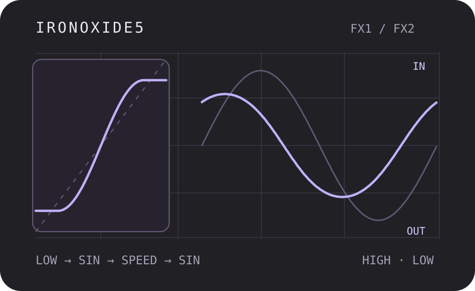
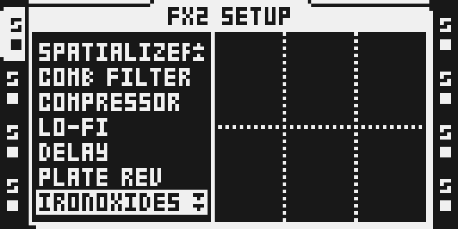
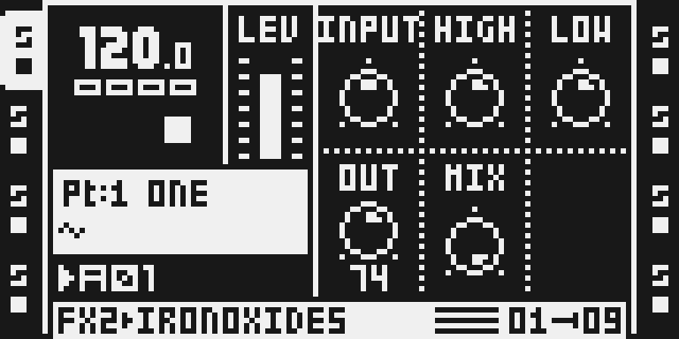

# IronOxide5

Version: 0.1.0-experimental · author: @devilfish707 · algorithm: Airwindows (MIT)

**Source draft.** It is outside native discovery, the catalog and the
firmware builder until hardware qualification and owner review are done
(see [Tests and measurements](#tests-and-measurements)).

## Overview

IronOxide5 is a DSP56300 port of Airwindows' IronOxide5, a tape emulation.
Each channel goes through:

1. a one-pole "tape low" highpass (LOW),
2. the input trim (INPUT) into a sine saturator, flat beyond ±π/2,
3. a leaky "tape speed" integrator (HIGH, in inches per second),
4. a second sine saturator that works as an output limiter,
5. the output trim (OUT) and the plugin's inv/dry/wet (MIX).

Like the plugin, every filter state has two independent copies that
alternate sample by sample, which changes the filters' real time constants.

At the defaults it rounds and thickens the signal and takes some top end
off. More INPUT drives the saturators harder; a lower HIGH makes a darker,
slower tape; a higher LOW leans out the bass.

It is a buffer-free insert: no allocator memory, no bus role and no absolute
Y addresses, so it runs on FX1 or FX2 of any track.

The Octatrack applies AMP VOL before the FX chain, so at the default VOL 64 a
normalized sample reaches the effect about 12 dB below where it reaches the
plugin in a DAW. The module therefore runs the plugin at +12 dB in and
−12 dB out (`plugin(4x) / 4`): with INPUT at 64 a normalized sample at VOL 64
saturates as it does in the plugin at its defaults, and dry and wet keep the
plugin's levels. Before this (OCTABAM4) the same setting gave 24 dB less
distortion than the plugin.

The plugin's Flutter and Noise knobs are not implemented. With both at 0 the
plugin's flutter stage returns its input and its noise stage does nothing,
so this module is the plugin at Flutter = Noise = 0. The plugin's 32-tap
slow filter is dead code in the shipped source and is absent here too.

The module was written in octabam (13 Sep 2026) and built there, but never
heard. Run against the plugin's own code for this port, its per-sample path
measured a peak error of 2.0, so that path was rewritten (see
[Tests and measurements](#tests-and-measurements)).

## Controls

All five controls are on the FX main page. The SETUP page has no IronOxide5
controls.

| slot | control | default | range | what it does |
|---|---|---|---|---|
| 0 | INPUT | 64 | 0–127 | Input trim, −18 dB at 0 to +18 dB at 127; 64 is 0 dB, the plugin's default drive for a normalized sample at AMP VOL 64 (see Overview). Drives the first saturator. |
| 1 | HIGH | 72 | 0–127 | Tape speed, 1.65 to 165 ips as knob⁴. Higher is brighter and tighter; 72 is the plugin's 15 ips. |
| 2 | LOW | 72 | 0–127 | Tape low: the highpass before the saturator. Higher values cut more bass. |
| 3 | OUT | 64 | 0–127 | Output trim of the wet signal, −18 to +18 dB; 64 is 0 dB. |
| 4 | MIX | 127 | 0–127 | Dry/wet: 0 is dry, 127 fully wet. |

The plugin's sliders map directly: INPUT, HIGH, LOW and OUT are the slider
value × 128. The plugin's last knob is inv/dry/wet: its lower half adds the
wet signal *inverted* to the dry, and dry is at its middle. MIX covers only
the upper half, dry at 0 to fully wet at 127, so at MIX 0 the tape path is
silent whatever the other knobs do. The defaults are the plugin's.

## Usage

1. Select an audio track that plays a sample.
2. Hold FUNC and press FX2 (or FX1) to open its SETUP. Turn LEVEL to
   IRONOXIDE5 and press YES.
3. Press FX2 (or FX1) for the main page.

A useful start on drums or bass: INPUT 90, OUT 50, HIGH 60, LOW 72, MIX 127.
Bring OUT up until the level matches MIX 0 (dry).

## Quick tutorial: put a loop on tape

1. **Set up.** On a track playing a drum or bass loop, hold FUNC and press FX2, turn LEVEL to IRONOXIDE5 and press YES. Press FX2 to see INPUT, HIGH, LOW, OUT and MIX at their defaults.
2. **Drive it.** Turn INPUT up to about 90 for more saturation and OUT down to about 50 to keep the level. Lower HIGH towards 40 for a darker, slower tape; raise LOW to thin the bass.
3. **Compare.** Turn MIX to 0 to hear the dry track, then back to 127. Re-selecting IRONOXIDE5 clears its internal state.

## Compatibility and limitations

- Location: FX1 or FX2, any of the eight tracks. Effect ID 0x1e, which is
  not a stock ID and no Octamod module or the TapeHead draft claims. Build
  priority 18 and harness letter `5`. The ledger found no clash; `make
  modules` stays the arbiter.
- OS 1.40C only, as for every Octamod module. MKI and MKII use the same DSP
  code; the MKII panel has been captured in the emulator only.
- 44.1 kHz, as the plugin's coefficients assume.
- AMP VOL is part of the drive, as the track level into the plugin would be
  in a DAW: above VOL 64 a normalized sample drives harder than the plugin
  does at the same INPUT. Lower VOL or INPUT for a cleaner result.
- OUT above 64 can push the output past full scale, where the DSP's output
  store limits it.
- MIX is a plain dry/wet; the plugin's inverted half is not available. (The
  OCTABAM3 test image still had it: MIX 0 there was dry plus inverted wet,
  so HIGH and LOW still changed the sound. Reported on hardware 2 Oct 2026,
  fixed in OCTABAM4.)
- 194 cycles/sample per instance by the static counter, the same at every
  setting. Eight instances on one core (FX1 and FX2 on four tracks) price at
  1,552 of the 3,120 cycles/core modules may use.
- octabam had this module on stock COMPRESSOR's ID with `replaces=`; here
  it has its own ID and COMPRESSOR stays.

## Tests and measurements

See [TESTING.md](TESTING.md) for commands and numbers. In short:

- **Against the plugin (emulator):** `verify.py` assembles
  `ironoxide5.asm`, runs it in `dsp_host` and compares it with
  `reference.py`, a line-for-line port of `IronOxide5Proc.cpp`. Peak error
  is 3.7e-4 over nine knob settings (defaults, every extreme, mixed) × seven
  signals at two levels (−2 dBFS, and 0.22 FS: a normalized sample at VOL
  64). At the defaults a normalized 100 Hz sine at the unit's level has
  −19.6 dB THD against the plugin's −19.9 dB at 0 dBFS (OCTABAM4: −44.1 dB). Silence in gives silence out; MIX 0 is dry within 1 LSB at any
  setting and MIX 64 is the linear blend; the stereo channels are independent; the sample
  routines are straight-line; no `mpysu` remains; split blocks match unsplit
  ones bit for bit, so the A/B alternation survives a call boundary. In the
  composed test image it renders within 4.7e-5 of the plugin at the
  defaults.
- **Against SPRING REV (emulator, `benchmark.py`):**

  | | IronOxide5 | Spring Reverb |
  |---|---:|---:|
  | one instance, instructions per sample | 185 | 262 |
  | four per core, worst peak per 16-sample block | 13,144 | 20,376 |
  | DSP program | 654 words | 1,063 words |
  | FX2 instance buffer | none | 16,384 words |
  | state | 28 words of its r7 block | — |

- **Rewritten from the octabam build**, which measured a peak error of 2.0
  against the plugin (0.64 at the defaults):
  1. The saturators squared their argument with `mpy y0,y1`, which encodes
     as `mpysu`: the negative half of both saturators was wrong.
  2. The branchless min stages returned 2 × min, so both saturators ran at
     twice their input.
  3. The A/B selection wrote a data value into n7, the dispatcher's frame
     count. It now uses r4/r5, swapped every sample.
- **Optimised:** a degree-5 minimax sine replaces the degree-7 one (error
  6.8e-5), the highpass update takes three fewer instructions, and a
  shift pair folds away. One instance went from 4,455 to 2,954 executed
  instructions per block, 34% less than the octabam build.
- **Input level** (after the OCTABAM4 listen, "saturates less than the
  plugin"): AMP VOL's (v/127)² ahead of the FX left a normalized sample
  12 dB short of the plugin's drive. Fixed with `plugin(4x)/4`. The highpass
  and dry path are linear, so this is inputgain × 4 and outputgain / 4, done
  by reading the existing words at different shifts: no word or cycle added.
- **Composed build:** `ironoxide5-spring` builds, packs into
  `OCTATRACK_OCTABAM8.bin` with a valid checksum, boots in the emulator and
  draws the chooser and page below. `verify_menu`, `verify_initregs`,
  `verify_replaces --image` and `label_fmt` pass.
- **On hardware:** OCTABAM3 was flashed on 2 Oct 2026; its MIX 0 was not dry
  (fixed in OCTABAM4, see Compatibility). OCTABAM4, flashed the same day,
  saturated less than the plugin (fixed in OCTABAM8). OCTABAM8 was flashed
  the same day on the author's MKII and reported working (a listening test,
  not a stress run).
- **Not done:** the 60-minute eight-track hardware stress project
  and worst-case cycles measured on hardware.

## Authorship and licences

- IronOxide5 port, manifest, gate, reference model and documentation:
  @devilfish707, MIT ([LICENSE](LICENSE)).
- Algorithm: Airwindows IronOxide5, Copyright (c) 2016 airwindows (Chris
  Johnson), MIT. The full notice is in [LICENSE](LICENSE) and
  [`../../octabam/licenses/airwindows.txt`](../../octabam/licenses/airwindows.txt).
- Built and verified with the octabam SDK, Copyright (c) 2026 Sam Banks, MIT.
- The thumbnail is original, drawn from `reference.py`'s output. It is an
  illustration, not an Octatrack screenshot.
- No Elektron firmware, extracted routines or tables are included.

## Screens and audio

Captured from the MKII panel of the Octamod emulator running the hardware
test image (`hardware-test-remix.py`): real LCD pixels, not a
reconstruction. No audio is included.

## Files

| file | what it is |
|---|---|
| `ironoxide5.asm` | the DSP56300 source |
| `manifest.py` | the native declaration: ID, menu, controls, gate |
| `verify.py` | the render gate (standalone `dsp_host`, no firmware) |
| `reference.py` | the plugin's processing in Python, and the knob mapping |
| `gen_constants.py` | octabam's generator for the per-block coefficient fits |
| `benchmark.py` | instruction counts against stock SPRING REV (needs your local 1.40C) |
| `hardware-test-remix.py` | the remix the OCTABAM3, 4 and 8 test images were built from |
| `octamod.module.json` | website metadata |
| `qualification.example.json` | the qualification record, incomplete |
| `presentation/thumbnail.svg` | the card illustration |
| `media/` | emulator LCD captures and their provenance |
