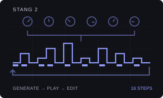
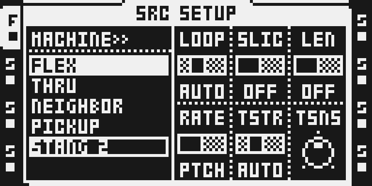
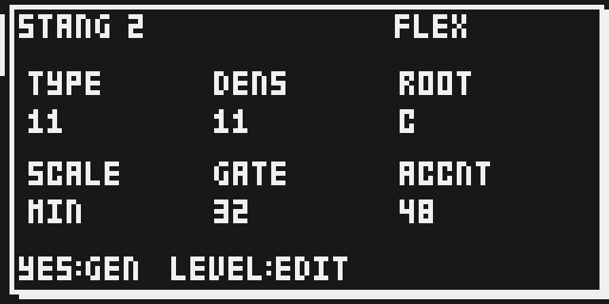
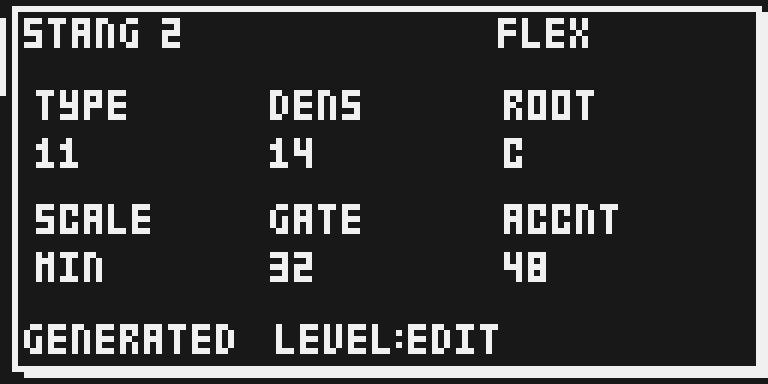
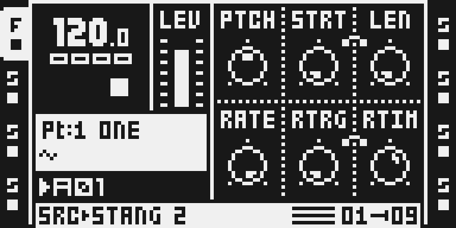
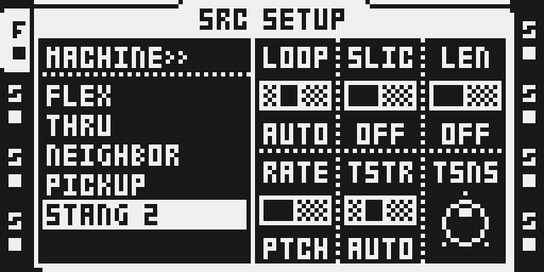

# Stang 2

Version: `0.1.0-experimental` · author: @repeat98 / Octamod contributors.

**Source draft: unavailable in the configurator and not qualified for flashing.**
The generator, native adapter and documentation are supplied for review. Keep it
under `sdk/drafts/stang-2/` until the module workflow, qualification and owner
review are complete. No new entry belongs in the frozen qualification baseline.

## Overview

Stang 2 is an original sample-pattern generator inspired by
[Iftah’s Sting 2](https://www.if-tah.com/devices/sting-2/). It creates **real trigs**
and pitch, gate and accent parameter locks for one selected Flex or Static
sample. It generates internal sample notes, with no MIDI output. The algorithm
is original; this is not a port or exact emulation of Iftah’s implementation.

Generation controls are on **SRC main**. Push LEVEL to switch to the normal
sample editor; the generated pattern is accessible through the ordinary trig
and parameter-lock workflow. The native sequencer repeats the resulting phrase.
STOP/PLAY never intentionally rerolls a populated track. First PLAY fills only
an empty track; automatic generation refuses existing trigless/recorder events,
slide marks and parameter locks too. Core tests verify the record contract;
native transport behavior still needs qualification.

## Controls

| SRC encoder | Control | Default | Range and behavior |
|---|---|---|---|
| A | TYPE | 11 | 0–15. Low values favor varied scale notes; higher values prefer tonic/fifth and stronger beat positions. Original algorithm; not a byte-identical Sting port. |
| B | DENS | 11 | 0–16. Note count is round(length × DENS / 16). Zero is silence; 16 fills the active length. Changes take effect on Generate. |
| C | ROOT | 0 | C–B. Sample reference is C at neutral PTCH. Tune the source sample accordingly. Pitch locks stay within −12 to +12 semitones. |
| D | SCALE | 1 | Chromatic, natural minor, major, Dorian or minor pentatonic. All generated pitches remain in the selected scale. |
| E | GATE | 32 | 0–126 in native AMP HOLD units, not percent or milliseconds. Generated HOLD locks range from half to all of this value. AMP REL still shapes the audible tail. |
| F | ACCNT | 48 | 0–127. Strong notes keep the Part AMP VOL. Other notes are attenuated by up to half; zero gives equal volumes. This writes AMP VOL locks, not MIDI velocity. |

- **YES** on the generator: create a new variation and replace the current
  track’s musical phrase. Edits to the six knobs affect the next generation.
- **Push LEVEL** on SRC: toggle generator / standard sample editing. The
  normal PTCH, STRT, LEN, RATE, RTRG and RTIM controls retain their own values.
- **Pattern/track scale menu:** length 1–64, track speed and swing remain the
  native sequencer controls. No private clock is maintained. The same native
  tempo/track speed/swing mask that Euclid follows now acts directly on Stang’s
  real trigs. Generation preserves swing mask bytes 0x40–0x47 and track
  length/scale/swing values exactly; the source tests check this explicitly.
- **AMP:** ordinary ATK/REL and the other controls still shape the sample.
  Generated GATE uses HOLD locks; generated accents use VOL locks.
- **SRC SETUP:** standard Flex/Static settings. First choose the desired pool,
  then select STANG 2; selecting Stang retains that pool and its chosen sample.
  Double-tap the TRACK key for the ordinary sample browser.

Scale names: CHR = chromatic; MIN = natural minor; MAJ = major; DOR = Dorian;
PENT = minor pentatonic. ROOT assumes the sample sounds C at PTCH 0. GATE is a
native HOLD value, not a promise of a fixed percentage or duration. High TYPE
favors tonic/fifth and beat positions; low TYPE uses a wider scale-note palette.
Density is deterministic for a given seed and adding density retains the notes
already selected at lower densities. ACCNT 0 gives all notes the Part VOL;
127 leaves strong notes at that level and halves unaccented notes.

## Usage

Use a disposable project on a separately qualified local image. Choose the
pool before selecting Stang: FUNC+SRC → FLEX or STATIC → YES, load a sample,
then FUNC+SRC → STANG 2 → YES. Press SRC for generation controls. A one-shot
bass sample tuned to C is a useful starting point. No pre-entered trigs are
needed. Choose a short pattern first, then inspect the generated notes in EDIT.

During playback, this draft queues an explicit Generate request until STOP.
It does not rewrite pattern memory from an audio interrupt or race the running
sequencer. Changing bank, Part, pattern or track cancels that queued request.
Immediate bar-boundary live replacement is future integration work. There is
no custom Undo yet: duplicate the pattern before replacing a phrase you want
to keep. Ordinary sample/FX editing and saving remain the stock workflow.

Selecting a normal Flex/Static machine removes the Stang marker and retains
the generated trigs. The six generator settings and variation seed use the
otherwise unused NEIGHBOR slots of that track’s Part and SRAM mirror; sample
playback parameters and sample selection are not repurposed. Part validation,
save/reload and power-cycle persistence are still native qualification gates.

## Generate a phrase, then edit a note

1. Select an audio track. Choose FLEX or STATIC in FUNC+SRC, load one tuned sample from that pool, then reopen FUNC+SRC, move DOWN to STANG 2 and press YES. Stang keeps the selected pool and sample.

2. Press SRC to show TYPE, DENS, ROOT, SCALE, GATE and ACCNT on encoders A–F. Start with TYPE 11, DENS 11, ROOT C, SCALE MIN, GATE 32 and ACCNT 48. Use the normal scale menu for pattern/track length, speed and swing.

3. On an empty track, press PLAY to request the first phrase automatically. The intended playback uses real sequencer trigs and PTCH/HOLD/VOL locks and then repeats. A track with existing trigs, locks or recorder events is left alone. Native transport/audio behavior is not qualified yet.

4. Press LEVEL to switch from the generator to ordinary SRC editing. Enable grid recording, hold a trig and turn PTCH to edit a note. AMP exposes its generated HOLD/VOL locks. Press LEVEL on SRC again to return to generation.

5. Press YES in the generator to replace the current track’s musical phrase. While playing, the draft queues this until STOP; changing bank, Part, pattern or track cancels it. STOP/PLAY otherwise preserves the phrase and edits. Select normal FLEX/STATIC to remove Stang while retaining the generated pattern.

## Compatibility and limitations

- Base: locally verified original OS 1.40C. No supported hardware claim yet.
  UI evidence uses the MKII panel emulator; MKI entry points need verification.
- Pitch is bounded to ±12 semitones and snapped to the selected scale.
  One sample supplies the melody; existing sample locks are preserved on
  explicit regeneration and can intentionally choose another sample.
- Generate replaces the note mask and PTCH/HOLD/VOL locks on this track’s
  64-step lane. It resets timing, condition, one-shot and slide state belonging
  to old/new note trigs. Other parameter locks, recorder masks and swing remain.
  A preserved lock on a new rest becomes a trigless lock.
- The generator settings are not native LFO/scene/p-lock destinations. Use
  EDIT for ordinary lockable sample parameters. No external MIDI is emitted.
- Analog BD claims the same chooser/display sites and conflicts. Other
  combinations (including OctaKit) need explicit integration verification.
- The current DRAM loader reserves **1,707 audio pages / 10,487,808 bytes**,
  shared across DRAM modules. The original generator is much smaller, but this
  loader cost is real. Complete allocation/stack/window accounting is pending.
- Native pattern dirty-state, lock bitmap, Part/SRAM persistence, first-PLAY
  dispatch and playback with both pools are unqualified. The module’s native
  gate fails closed. Screenshots and host tests are not hardware proof.

## Tests and measurements

See [TESTING.md](TESTING.md) for exact commands and the difference between core
behavior, private UI capture, and remaining qualification. The source includes
`engine.c`, `engine.h`, `test_engine.c`, `native.c`, `hooks.s` and a guarded
native preparation recipe. No firmware is needed for the pure C core tests.

`prepare.py` must run in an isolated local native tree; it compiles original C
and derives four displaced instruction spans from the verified base at runtime.
Its `runtime.s`, ELF and image outputs contain stock content and must remain
temporary. Never commit them, put them in automation, or upload them.
`verify_native.py` deliberately rejects publication until native integration
and qualification evidence are complete. The native remixer remains the
composition oracle; the public catalog and download gate are unchanged.

## Authorship and licences

Original generator, tests, documentation and vector: Octamod contributors, MIT.
Native chooser/input-layer/window seams follow MIT octabam by Sam Banks, with
repeat98’s Analog BD integration retained as a design reference. See [LICENSE](LICENSE).
Iftah’s Sting 2 is the musical inspiration, with no copied source or artwork.
No exact Sting-algorithm parity, endorsement or legal clearance is claimed.

The original thumbnail is [licensed separately](presentation/LICENSE) and is
an illustration. Actual LCD captures are governed by [media/LICENSE.md](media/LICENSE.md);
underlying Elektron rights remain reserved. Owner/reviewer verification is
required before publication. No firmware, extracted routines/tables, raw
LCD/RAM dumps, cards, source samples or generated firmware images are included.

## Screens and audio

Actual monochrome LCD captures and version/source/build provenance are recorded
in [media/capture.json](media/capture.json). Only successfully selected Stang
pages are included. No audio preview or real-hardware evidence is asserted.

Choose STANG 2 after selecting the Flex or Static backing pool.

SRC exposes TYPE, DENS, ROOT, SCALE, GATE and ACCNT on encoders A–F.

Encoder B changes DENS to 14; YES reports GENERATED while transport remains stopped.

Push LEVEL to access native PTCH, STRT, LEN, RATE, RTRG and RTIM.

FUNC+SRC retains the native sample setup controls for the backing pool.
